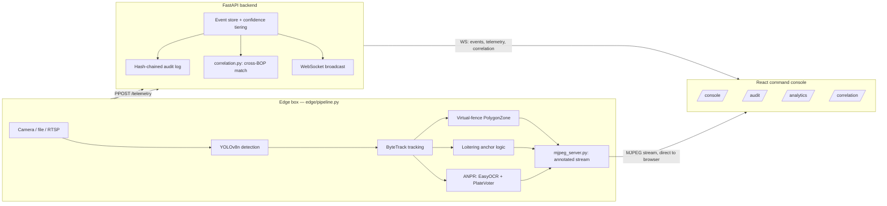

# System Architecture

## Design principle: edge-first

Border connectivity is intermittent, so detection, tracking, and rule logic run locally at the edge box; only event metadata (never raw video, except confirmed-alert clips) crosses to the command backend.

## Pipeline diagram

## Real API surface (backend, `backend/app/main.py`)

| Endpoint | Purpose |
|---|---|
| `POST /events` | Edge pipeline posts a detection/behavior event; triggers confidence tiering, audit log entry, WS broadcast, and correlation check |
| `GET /events` | Dashboard fetches event history |
| `POST /events/{id}/review` | Human confirm/dismiss action |
| `POST /telemetry` | Edge pipeline posts live FPS/latency/track-count/zone-polygon |
| `GET /telemetry/{camera_id}` | Dashboard seeds HUD state on mount |
| `GET /audit` | Full audit log |
| `GET /audit/verify` | Recomputes the hash chain, returns valid/invalid |
| `WS /ws` | Broadcasts `event`, `event_updated`, and `telemetry` messages to every connected dashboard |

## Tech stack (what's actually installed, not aspirational)

| Layer | Choice | Why |
|---|---|---|
| Edge inference | YOLOv8n (Ultralytics) + ByteTrack (`supervision`) | Pretrained, real-time on commodity hardware — measured ~10-15 FPS on a laptop CPU |
| ANPR | EasyOCR + custom modal-vote fusion (`edge/anpr.py`) | Pure-Python, no C++ build issues; multi-frame fusion is the accuracy mechanism, not the OCR engine itself |
| Video preview | Hand-built MJPEG-over-HTTP (`edge/mjpeg_server.py`) | A few dozen lines, zero extra dependencies, every browser renders it natively — chosen over WebRTC/RTSP-out for hackathon-timeline reliability |
| Backend | FastAPI + SQLAlchemy + SQLite | Async-friendly, fast to iterate; SQLite is sufficient for a prototype's event volume |
| Audit ledger | Hand-rolled SHA-256 hash chain (`backend/app/audit.py`) | The Blockchain & Cybersecurity theme's cheapest, most defensible answer |
| Frontend | React 19 + Vite + Tailwind v4 + React Router | Multi-page site, not a single dashboard component |
| UI components | shadcn/ui, ReactBits, Aceternity (free tiers only) | See component-by-component sourcing notes in each file's own comments |
| Charts | Recharts wrapped in shadcn's `chart` component | Themed tooltips/legends over raw Recharts |

## What crosses which boundary

- **Edge → Backend**: event metadata (JSON), telemetry (JSON) — never raw video
- **Edge → Browser**: the MJPEG preview stream, direct (bypasses the backend and Vite's dev proxy, which can't relay an unbounded multipart stream — see git history for why)
- **Backend → Browser**: WebSocket broadcasts (events, telemetry, correlation matches) + REST for history/seeding
